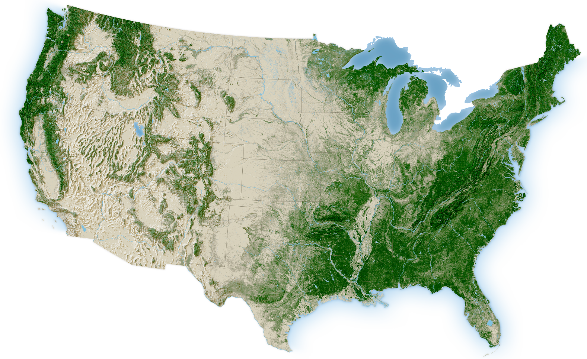

```{r, message=FALSE, warning=FALSE,}
library(dplyr)
library(readr)
library(dplyr)
library(ggplot2)
library(tidyr) 
```

```{r, message=FALSE, warning=FALSE}
bigfoot <- readr::read_csv('https://raw.githubusercontent.com/rfordatascience/tidytuesday/main/data/2022/2022-09-13/bigfoot.csv')
```

------------------------------------------------------------------------

# Preguntas para contestar

¿Qué estados tienen la mayor cantidad de avistamientos?

¿Qué condado del estado de Washington tiene la mayor cantidad de avistamientos?

¿Qué temporada tiene la mayor cantidad de avistamientos?

¿En qué años fueron más prevalentes los avistamientos?

¿Cuál es el patrón?

------------------------------------------------------------------------

# Variables establecidos

```{r}
#En que estados se encontraron bigfoot (mayor a menor)
bigfoot_states <- bigfoot %>% 
  count(state) %>% 
  arrange(desc(state))

#En que county de washington tiene la mayor cantidad de avistamientos
bigfoot_washington_counties <- bigfoot %>% 
  filter(state == "Washington") %>%
  count(county) %>% 
  arrange(desc(n)) %>% 
  slice_head(n = 10)

# Top 10 estados con la mayor cantidad de avistamientos 
bigfoot_states_limpio <- bigfoot_states %>% 
  arrange(desc(n)) %>% 
  slice_head(n = 10)


# En que temporada se encontraron bigfoot (mayor a menor)
bigfoot_season <- bigfoot %>% 
  count(season) %>% 
  arrange(desc(season))

# En que año los avistamientos fueron más prevalentes
bigfoot_dates <- bigfoot %>%
  mutate(year = substr(date, 1, 4)) %>%
  count(year) %>% 
  arrange(desc(n)) %>% 
  slice_head(n = 10)
```

------------------------------------------------------------------------

Las gráficas siguiente nos sirve para ver cuales son los estados con la mayor cantidad de avistamientos con Bigfoot.

El dataset también proporciona la longitud y latitud en que se ocurrió el avistamiento, por lo cual podemos graficar una mapa que muestra los puntos donde concentran los avistamientos.

::: {.callout-note appearance="minimal"}
## Gráfica de los 10 estados con la mayor cantidad de avistamientos del Pie Grande

```{r}
bigfoot_states_limpio %>%
  mutate(state = reorder(state, n)) %>%
  ggplot(aes(x = state, y = n, fill = n)) +
  geom_col() +
  coord_flip() +
  scale_fill_gradient(
    low = "lightgreen",
    high = "darkgreen"
  ) +
  labs(
    title = "Top 10 estados con la mayor cantidad de avistamientos",
    x = "Nombre del estado",
    y = "Número de avistamientos"
  ) +
  theme(legend.position = "none")

```
:::

::: {.callout-note appearance="minimal"}
## Los avistamientos con la mapa del EUA

```{r}
ggplot(data = bigfoot, aes(x = longitude, y = latitude)) +
  geom_point(size = .5, alpha = 0.3, na.rm = TRUE) +
  labs(
    title = "Donde se encuentran los avistamientos de Bigfoot",
    x = "Longitud",
    y = "Latitud",
  ) +
  theme_minimal()
```
:::

{fig-align="center" width="471"}

------------------------------------------------------------------------

Esta gráfica señala los condados del estado de Washington con la mayor cantidad de avistamientos de Bigfoot

::: {.callout-note appearance="minimal"}
## Condados del estado de Washington

```{r}
bigfoot_washington_counties %>%
  mutate(county = reorder(county, n)) %>%
  ggplot(aes(x = county, y = n, fill = n)) +
  geom_col() +
  coord_flip() +
  scale_fill_gradient(
    low = "lightgreen",
    high = "darkgreen"
  ) +
  labs(
    title = "Avistamientos de Bigfoot en el estado de Washington",
    x = "Nombre del condado",
    y = "Número de avistamientos"
  ) +
  theme(legend.position = "none")
```
:::

------------------------------------------------------------------------

Gráfica que muestra en qué temporada ocurrió más avistamientos:

::: {.callout-note appearance="minimal"}
## Temporadas de Bigfoot

```{r}
bigfoot_season %>%
  mutate(season = reorder(season, n)) %>%
  ggplot(aes(x = season, y = n, fill = n)) +
  geom_col() +
  coord_flip() +
  scale_fill_gradient(
    low = "lightgreen",
    high = "darkgreen"
  ) +
  labs(
    title = "Temporadas de Bigfoot",
    x = "Season",
    y = "Número de avistamientos"
  ) +
  theme(legend.position = "none")
```
:::

------------------------------------------------------------------------

Gráfica que muestra los años que tuvieron la mayor cantidad de avistamientos:

```{r}
bigfoot_dates %>%
  mutate(date = reorder(year, n)) %>%
  ggplot(aes(x = year, y = n, fill = n)) +
  geom_col() +
  coord_flip() +
  scale_fill_gradient(
    low = "lightgreen",
    high = "darkgreen"
  ) +
  labs(
    title = "Años de Bigfoot",
    x = "Año",
    y = "Número de avistamientos"
  ) +
  theme(legend.position = "none")

```

:::

Los datos anteriores nos ayudo contestar qué patrón tiene los avistamientos de Bigfoot.
