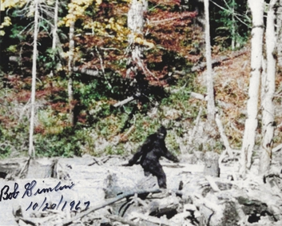
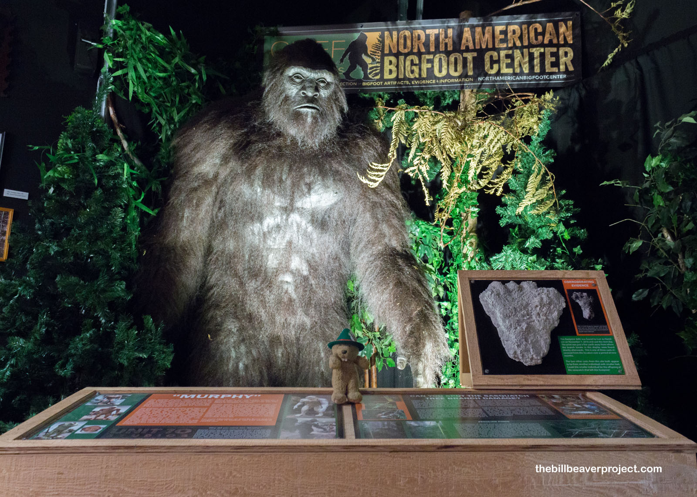

```{r, message=FALSE, warning=FALSE, echo=FALSE}
library(dplyr)
library(readr)
library(dplyr)
library(ggplot2)
library(tidyr) 
```

```{r, echo=FALSE, message=FALSE, warning=FALSE}
bigfoot <- readr::read_csv('https://raw.githubusercontent.com/rfordatascience/tidytuesday/main/data/2022/2022-09-13/bigfoot.csv')
```

```{r, echo=FALSE}
#En que estados se encontraron bigfoot (mayor a menor)
bigfoot_states <- bigfoot %>% 
  count(state) %>% 
  arrange(desc(state))

#En que county de washington tiene la mayor cantidad de avistamientos
bigfoot_washington_counties <- bigfoot %>% 
  filter(state == "Washington") %>%
  count(county) %>% 
  arrange(desc(n)) %>% 
  slice_head(n = 10)

# Top 10 estados con la mayor cantidad de avistamientos 
bigfoot_states_limpio <- bigfoot_states %>% 
  arrange(desc(n)) %>% 
  slice_head(n = 10)


#En que temporada se encontraron bigfoot (mayor a menor)
bigfoot_season <- bigfoot %>% 
  count(season) %>% 
  arrange(desc(season))

# En que año los avistamientos fueron más prevalentes
bigfoot_dates <- bigfoot %>%
  mutate(year = substr(date, 1, 4)) %>%
  count(year) %>% 
  arrange(desc(n)) %>% 
  slice_head(n = 10)
```

------------------------------------------------------------------------

## Bigfoot (Pie Grande)

{fig-align="center" width="519"}

**Bigfoot**, o también llamado el **'Pie Grande'**, es un animal críptico que tiene apariencia de un hominido bípedo.

El origen de su leyenda proviene de las tradiciones orales de los pueblos indígenas del Noreste, quienes originalmente le llamaron **'Sasquatch'** en su lengua. La leyenda del Bigfoot sigue popular con la creación de medios como video juegos y películas que hacen referencia a este críptico.

------------------------------------------------------------------------

## Avistamientos

Han reportado 'avistamientos' numerosos con este entidad críptico en la vida real por las personas desde los años 1900, con los datos proporcionados buscamos donde proviene la mayoría de estos reportes y si hay algún patrón con estos avistamientos.

------------------------------------------------------------------------

# Preguntas para contestar

¿Qué estados tienen la mayor cantidad de avistamientos?

¿Qué condado del primer estado tiene la mayor cantidad de avistamientos?

¿Qué temporada tiene la mayor cantidad de avistamientos?

¿En qué años fueron más prevalentes los avistamientos?

¿Cuál es el patrón?

------------------------------------------------------------------------

### ¿Qué estados tienen la mayor cantidad de avistamientos?

::: {.callout-note appearance="minimal"}
## Gráfica de los 10 estados con la mayor cantidad de avistamientos del Pie Grande

```{r, echo=FALSE}
bigfoot_states_limpio %>%
  mutate(state = reorder(state, n)) %>%
  ggplot(aes(x = state, y = n, fill = n)) +
  geom_col() +
  coord_flip() +
  scale_fill_gradient(
    low = "lightgreen",
    high = "darkgreen"
  ) +
  labs(
    title = "Top 10 estados con la mayor cantidad de avistamientos",
    x = "Nombre del estado",
    y = "Número de avistamientos"
  ) +
  theme(legend.position = "none")

```
:::

La mayoría de los avistamientos se concentran en los estados del pacífico (Washington, Oregon y California) debido a sus extensos bosques, montañas y áreas naturales.

::: {.callout-note appearance="minimal"}
## Los avistamientos con la mapa del EUA

Gráfica que muestra donde se ubica todos los avistamientos de bigfoot utilizando la latitud y longitud que proporciona el data set.

```{r, echo=FALSE}
ggplot(data = bigfoot, aes(x = longitude, y = latitude)) +
  geom_point(size = .5, alpha = 0.3, na.rm = TRUE) +
  labs(
    title = "Donde se encuentran los avistamientos de Bigfoot",
    x = "Longitud",
    y = "Latitud",
  ) +
  theme_minimal()
```
:::

Los puntos en la gráfica coincide con las zonas boscosas del territorio principal como el noreste, la región de los Apalaches y el noroeste del Pacífico.

{fig-align="center" width="471"}

------------------------------------------------------------------------

### ¿Qué condado del estado de Washington tiene la mayor cantidad de avistamientos?

::: {.callout-note appearance="minimal"}
## Condados del estado de Washington

Esta gráfica top 10 condados del estado de Washington con la mayor cantidad de avistamientos con el Pie Grande.

```{r, echo=FALSE}
bigfoot_washington_counties %>%
  mutate(county = reorder(county, n)) %>%
  ggplot(aes(x = county, y = n, fill = n)) +
  geom_col() +
  coord_flip() +
  scale_fill_gradient(
    low = "lightgreen",
    high = "darkgreen"
  ) +
  labs(
    title = "Avistamientos de Bigfoot en el estado de Washington",
    x = "Nombre del condado",
    y = "Número de avistamientos"
  ) +
  theme(legend.position = "none")
```
:::

Pierce County es un condado que contiene una gran cantidad de naturaleza y actividad humana, esto aumentan la probabilidad de que se registren más avistamientos de Bigfoot.

------------------------------------------------------------------------

### ¿Qué temporada tiene la mayor cantidad de avistamientos?

::: {.callout-note appearance="minimal"}
## Temporadas de Bigfoot

El siguiente muestra la cantidad de avistamientos registrados en cada temporada.

```{r, echo=FALSE}
bigfoot_season %>%
  mutate(season = reorder(season, n)) %>%
  ggplot(aes(x = season, y = n, fill = n)) +
  geom_col() +
  coord_flip() +
  scale_fill_gradient(
    low = "lightgreen",
    high = "darkgreen"
  ) +
  labs(
    title = "Temporadas de Bigfoot",
    x = "Season",
    y = "Número de avistamientos"
  ) +
  theme(legend.position = "none")
```
:::

Los avistamientos con Bigfoot suelen ser más prominentes durante el verano y otoño porque las personas generalmente tienen más actividades en el aire libre durante las temporadas de calor.

------------------------------------------------------------------------

### ¿En qué años fueron más prevalentes los avistamientos?

::: {.callout-note appearance="minimal"}
## Gráfica que muestra los años que tuvieron la mayor cantidad de avistamientos

```{r, echo=FALSE}
bigfoot_dates %>%
  mutate(date = reorder(year, n)) %>%
  ggplot(aes(x = year, y = n, fill = n)) +
  geom_col() +
  coord_flip() +
  scale_fill_gradient(
    low = "lightgreen",
    high = "darkgreen"
  ) +
  labs(
    title = "Años de Bigfoot",
    x = "Año",
    y = "Número de avistamientos"
  ) +
  theme(legend.position = "none")

```
:::

En una gran cantidad de los avistamientos, el tiempo en se ocurieron es desconocido, pero los años 2000 tuvieron más avistamientos que los años anteriores

------------------------------------------------------------------------

### ¿Cuál es el patrón?

Estos avistamientos por lo general ocurren en áreas boscosas durante la temporada de verano, cuando hay más personas que realizan actividades al aire libre como senderismo y campismo. Esto incrementa la probabilidad de observar y reportar un posible avistamiento de Bigfoot.

{fig-align="center"}
